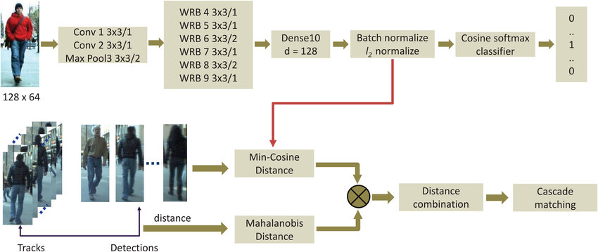

# Traffic-Management-System


[]((https://github.com/sonnguyen129/Trafic-Management-System/graphs/commit-activity))

## Web Application
Built a web application using Flask and Dash.


## Installation

* Clone this repository and check the ```requirements.txt```:
    ```shell
    git clone https://github.com/sonnguyen129/Trafic-Management-System
    cd Trafic-Management-System
    pip install -r requirements.txt
    ```

* Download YOLOX-S,M,L weights in [this repository](https://github.com/Megvii-BaseDetection/YOLOX) and add in ```./weights``` folder

* Simply run [Deploy webapp](./Deploy_webapp.ipynb) notebook.

    **Note**: The reason I don't deploy this repository to *Heroku* because it's very heavy, runs **1-2 FPS** with CPU. So I used *ngrok* to be able to deploy online and used Colab to take advantage of the GPU. However, run it if you have a powerful enough GPU (Colab's GPU runs around **8-14 FPS**, quite slow but better than CPU)


## Problem Statement
Detecting and tracking technologies have been very popular in recent years. Suppose the authorities install CCTV cameras to control the flow and speed of traffic on sections of roads, intersections, etc. Thereby, it is possible to see the speed, direction, and type of vehicles on the road.

### Why YOLOX

**YOLOX** is the state-of-the-art detector, known as YOLOv5 with some improvements. YOLOv5 are still anchor based detector and used hand-crafted assigning rules for training. Anchor free detector, advanced label assignment strategies and end-to-end detectors are integrated into YOLOX. In this project, I used COCO weights instead of training from scratch. 

<p align = 'middle'>
     
     
</p>

### DeepSORT

**DeepSORT** was developed immediately [SORT](https://arxiv.org/pdf/1602.00763.pdf) to address the omission problems associated with a high number of ID switches. The solution proposed by DeepSORT is based on the use of deep learning to extract features of objects to increase accuracy in the data association process. In addition, a linking strategy was also built called **Matching Cascade** to help link objects after disappearing for a while more effectively.




## References
* [YOLOX: Exceeding YOLO Series in 2021](https://arxiv.org/pdf/2107.08430.pdf)
* [Simple Online and Realtime Tracking with a Deep Association Metric](https://arxiv.org/pdf/1703.07402.pdf)
* [YOLOX](https://github.com/Megvii-BaseDetection/YOLOX)
* [DeepSORT](https://github.com/ZQPei/deep_sort_pytorch)